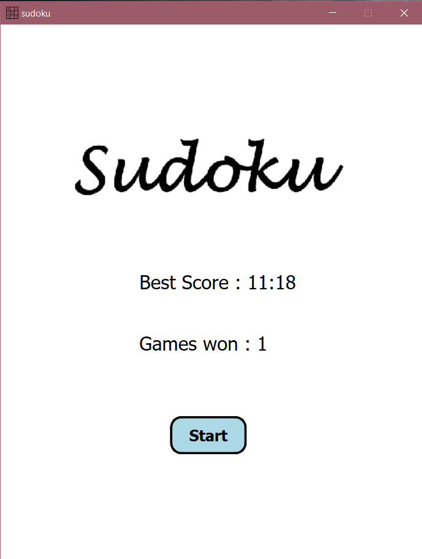
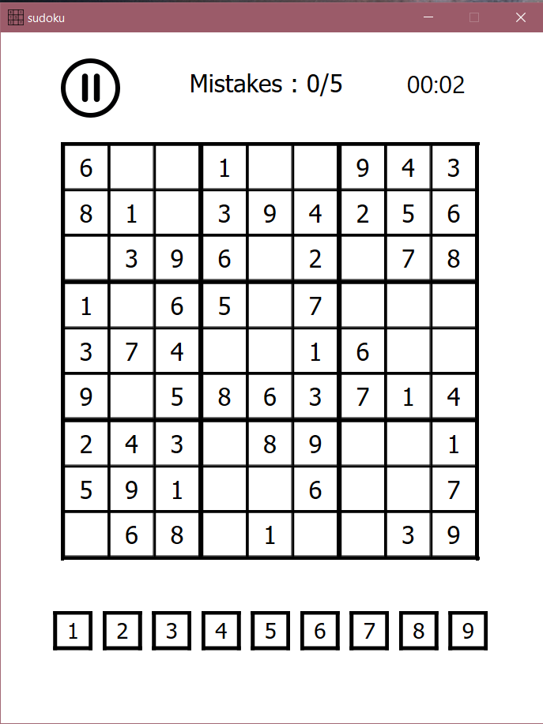

# Sudoku-in-python

This project is implemented in python using Qt framework for making a functional GUI application. The window.py file has all the logic for how the sudoku array or list[list[]] will be processed and displayed in 81 push buttons. 

whenever a button of a sudoku grid element is clicked, corresponding row, column and box elements are highlighted for good visibilty of numbers. A timer is also kept to keep record of highest score in game. Mistakes are also kept track of, if user makes 5 mistakes, the game will be over. 

Following is the sample of how my Application works: 

  
  

